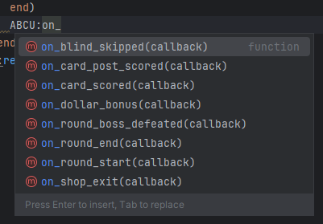
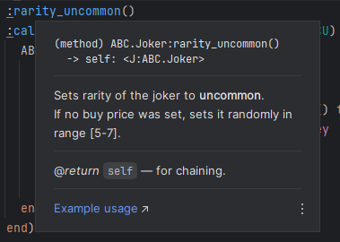
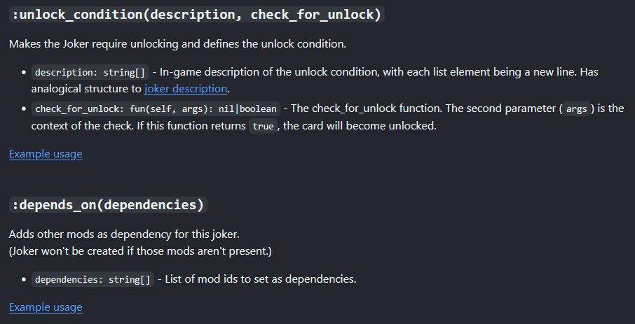
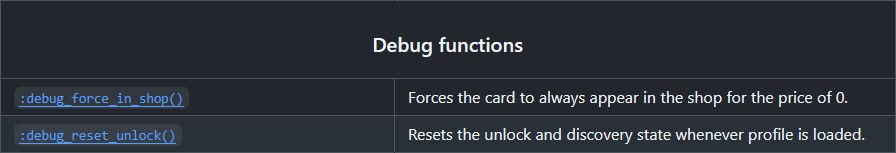

# Ari's Balatro (modding) Core

## If you are a player
You can install the library by [downloading the code](https://github.com/Aurif/balatro-ABC/archive/refs/heads/main.zip), unzipping it into and putting the `ABC` folder in your `Mods` folder (requires [Steammodded](https://github.com/Steamodded/smods/wiki) to be installed first).\
Other folders contain additional Balatro content like new jokers, so you can install them as well if you wish to.


## If you are a modder
This is a library (in early stages) built on top of [Steammodded](https://github.com/Steamodded/smods/wiki) that uses object-oriented approach to make modding Balatro easier. \
The `ABC` folder is the library itself, and all the other folders are just [various examples](https://github.com/Aurif/balatro-ABC/tree/main/Aris-Random-Stuff/jokers) of how to use it.

It is recommended that you visit [the documentation](https://github.com/Aurif/balatro-ABC/wiki/Joker).

--- 
Current library capabilities:
 - creating `common`, `uncommon`, and `rare` jokers
 - custom unlock conditions
 - [helpful debug functions](https://github.com/Aurif/balatro-ABC/wiki/Joker#debug-functions)

--- 
And now, for a short marketing reel:
## Why you may want to use ABC

### Simpler and more readable code
```lua
ABC.Joker("Voucher Joker")
    :description({"After defeating a Boss Blind", "gain a {C:attention}#tag#{}"})
    :variables({
        tag = ABC.VARS.Tag("tag_voucher"),
    })
    :rarity_uncommon()
    :calculate(function(self, card, context, ABCU)
      ABCU:on_round_boss_defeated(function ()
          ABCU.vars.tag:spawn()
      end)
    end)
    :register()
```
```lua
ABC.Joker("Checkered Joker")
    :description({ "All scored cards become", "{V:1}#suit#{}, suit changes", "every round" })
    :variables({
        suit = ABC.VARS.Suit('Spades'),
    })
    :rarity_common()
    :calculate(function(self, card, context, ABCU)
        ABCU:on_round_start(function()
            ABCU.vars.suit = ABC.VARS.Suit:random(pseudoseed('checkered'))
        end)
        ABCU:on_card_post_scored(function(scored_card)
            if not ABCU.vars.suit:card_is_exactly(scored_card) then
                ABC.Animations.modify_card(
                    function() ABCU.vars.suit:card_set(scored_card) end,
                    scored_card, card
                )
            end
        end)
    end)
    :unlock_condition(
        {"Win a run with", "{C:attention}Checkered Deck{}"},
        function(self, args)
            if args.type == 'discover_amount' or args.type == 'win_deck' then
                return ABC.VARS.Deck("b_checkered"):get_win_max_stake() > 0
            end
        end
    )
    :register()
```

### Full autocompletion support


### Both in-IDE and [web](https://github.com/Aurif/balatro-ABC/wiki) documentation




### [Many usage examples](https://github.com/Aurif/balatro-ABC/tree/main/Aris-Random-Stuff/jokers)

### Additional dev util functions

